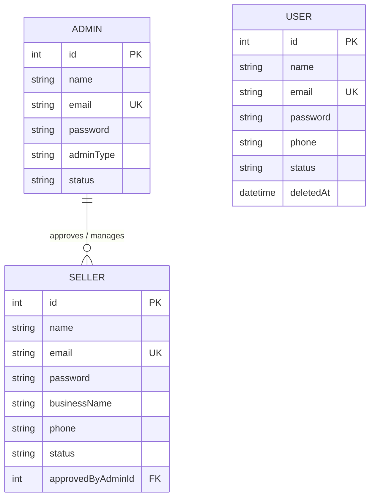
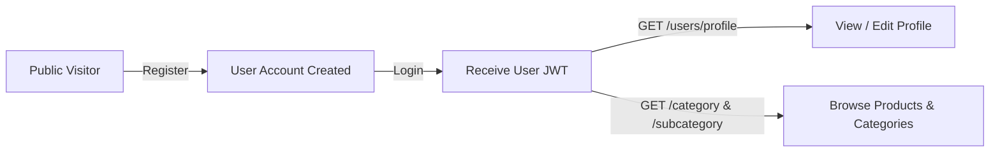
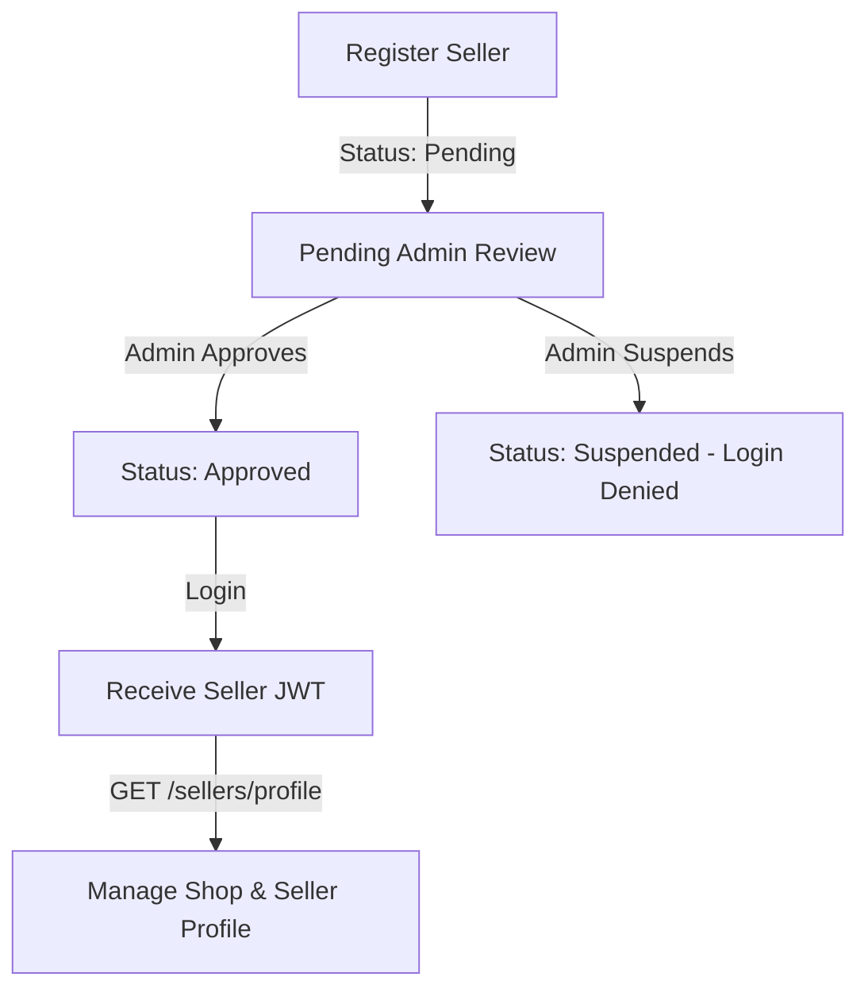
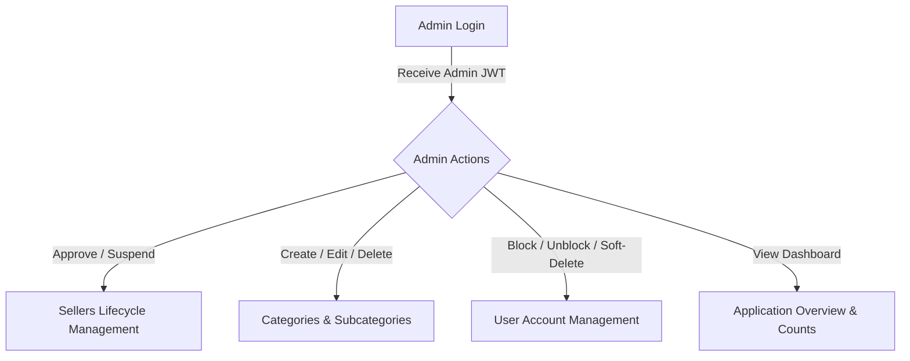

# Multi-Role API Project Documentation

`multi-role-api` is a RESTful backend API built with **Node.js**, **Express**, and **Sequelize ORM** using a **MySQL** database. It provides a multi-tenant role system separating End Users, Admins, and Sellers with custom status lifecycles, authentication (JWT + Bcrypt), and approval workflows.

> 📖 **Workflow & Access Control Guide**: For a detailed breakdown of role lifecycles and permissions, see [WORKFLOW.md](file:///f:/node_tasks/multi-role-api/WORKFLOW.md).

---

## 🛠️ Tech Stack & Key Dependencies

- **Runtime**: Node.js
- **Framework**: [Express.js](https://expressjs.com/) (`v5.2.1`)
- **ORM**: [Sequelize](https://sequelize.org/) (`v6.37.8`)
- **Database Driver**: [MySQL2](https://github.com/sidorares/node-mysql2) (`v3.23.3`)
- **CLI Tooling**: `sequelize-cli` (`v6.6.5`)
- **Security & Auth**: `bcryptjs`, `jsonwebtoken`, `dotenv`
- **Database**: MySQL (`ecommerce` database)

---

## 📁 Project Directory Structure

```text
multi-role-api/
├── app.js                   # Application entry point & Express server configuration
├── config/
│   └── config.json          # Database connection settings (development, test, production)
├── middleware/              # Custom Express middleware (JWT authentication, RBAC authorization)
│   └── auth.js              # Password hashing, JWT signing/verifying, and role middleware
├── migrations/              # Database migration scripts tracking schema changes
├── models/
│   ├── index.js             # Sequelize initialization & model auto-loader
│   ├── user.js              # User model (Customer/End-user)
│   ├── admin.js             # Admin model (SuperAdmin, Admin)
│   └── sellers.js           # Seller model (Vendors/Sellers)
├── routes/
│   ├── auth.js              # Unified Express router for /auth registration & login
│   ├── user.js              # Express router for /users CRUD, registration & login
│   ├── admin.js             # Express router for /admins CRUD, seller approval/suspension, reg & login
│   └── seller.js            # Express router for /sellers CRUD, registration & login
├── seeders/                 # Seed scripts for initial dummy database records
├── .env                     # Environment variables configuration
├── package.json             # Project metadata and dependencies
└── project.md               # Project documentation
```

---

## 🗄️ Database Schemas & Models

The architecture explicitly separates distinct user roles into dedicated database tables rather than relying on a generic `role` string on a single table.

### 1. User (`Users` Table)
Represents standard end-users / customers. Includes soft delete functionality (`paranoid: true`).

| Field | Data Type | Constraints | Description |
| :--- | :--- | :--- | :--- |
| `id` | `INTEGER` | Primary Key, Auto Increment | Unique User ID |
| `name` | `STRING` | Optional | User's full name |
| `email` | `STRING` | Unique, Not Null | Account email address |
| `password` | `STRING` | Not Null | Hashed account password |
| `phone` | `STRING` | Optional | User's contact number |
| `status` | `ENUM('Active', 'Blocked')` | Default: `'Active'`, Not Null | Account status flag |
| `createdAt` | `DATE` | Not Null | Record creation timestamp |
| `updatedAt` | `DATE` | Not Null | Record update timestamp |
| `deletedAt` | `DATE` | Optional | Soft deletion timestamp (`paranoid: true`) |

---

### 2. Admin (`Admins` Table)
Represents administrative accounts responsible for platform governance and approving seller registrations.

| Field | Data Type | Constraints | Description |
| :--- | :--- | :--- | :--- |
| `id` | `INTEGER` | Primary Key, Auto Increment | Unique Admin ID |
| `name` | `STRING` | Not Null | Admin's full name |
| `email` | `STRING` | Unique, Not Null | Admin login email |
| `password` | `STRING` | Not Null | Hashed admin login password |
| `adminType` | `ENUM('SuperAdmin', 'Admin')` | Default: `'Admin'`, Not Null | Hierarchy privilege level |
| `status` | `ENUM('Active', 'Suspended')` | Default: `'Active'`, Not Null | Admin account status |
| `createdAt` | `DATE` | Not Null | Record creation timestamp |
| `updatedAt` | `DATE` | Not Null | Record update timestamp |

---

### 3. Seller (`Sellers` Table)
Represents merchant / seller accounts that require admin approval before activation.

| Field | Data Type | Constraints | Description |
| :--- | :--- | :--- | :--- |
| `id` | `INTEGER` | Primary Key, Auto Increment | Unique Seller ID |
| `name` | `STRING` | Optional | Primary seller contact name |
| `email` | `STRING` | Unique, Not Null | Seller contact email |
| `password` | `STRING` | Not Null | Hashed seller account password |
| `businessName` | `STRING` | Optional | Registered business/shop name |
| `phone` | `STRING` | Optional | Business contact number |
| `status` | `ENUM('Pending', 'Approved', 'Suspended')` | Default: `'Pending'`, Not Null | Seller approval lifecycle state |
| `approvedByAdminId` | `INTEGER` | Foreign Key -> `Admins.id` | Admin who reviewed/approved the seller |
| `createdAt` | `DATE` | Not Null | Record creation timestamp |
| `updatedAt` | `DATE` | Not Null | Record update timestamp |

---

## 🔗 Entity Relationships



- **`Admin` → `Seller`**: One-to-Many (`Admin.hasMany(Seller, { foreignKey: 'approvedByAdminId' })`).
- **`Seller` → `Admin`**: Many-to-One (`Seller.belongsTo(Admin, { foreignKey: 'approvedByAdminId' })`).

---

## 🔄 Role Workflows & Feature Permissions Matrix

### 1. User Workflow (Customer / End-User)


- **What Users Can Do**:
  - Register (`POST /users/register` or `POST /auth/register`) and login (`POST /users/login`).
  - View, update, or soft-delete their own profile (`GET`, `PUT`, `DELETE` on `/users/profile`).
  - View all categories and subcategories (`GET /category`, `GET /subcategory`).
- **What Users Cannot Do**:
  - Cannot list all users or view other users' profiles.
  - Cannot create, update, or delete categories / subcategories.
  - Cannot approve or manage sellers.

---

### 2. Seller Workflow (Merchant / Vendor)


- **What Sellers Can Do**:
  - Register as a seller (`POST /sellers/register`). Account starts in **`Pending`** status.
  - Login once approved by an Admin (`POST /sellers/login`).
  - View, update, or delete their own seller profile (`GET`, `PUT`, `DELETE` on `/sellers/profile`).
  - Browse category catalog.
- **What Sellers Cannot Do**:
  - Cannot log in while in `Pending` or `Suspended` status.
  - Cannot self-approve or approve other sellers.
  - Cannot manage end-users or category structures.

---

### 3. Admin Workflow (Platform Governance & Catalog Management)


- **What Admins Can Do**:
  - Approve pending seller registrations (`PATCH /admins/sellers/:id/approve`).
  - Suspend active sellers (`PATCH /admins/sellers/:id/suspend`).
  - Create, update, and delete Categories (`POST`, `PUT`, `DELETE` on `/category`).
  - Create, update, and delete Subcategories (`POST`, `PUT`, `DELETE` on `/subcategory`).
  - View, block, unblock, and soft-delete User accounts (`/users` endpoints with Admin Token).
  - View system-wide counts and data overview (`GET /admins/overview`).

---

### 4. SuperAdmin Workflow (Super Governance)
- **Inherits all Admin privileges PLUS**:
  - Manage Admin accounts (`GET`, `PUT`, `DELETE` on `/admins`).
  - Permanently force delete soft-deleted user records (`DELETE /users/:id/force`).

---

## 📊 Summary Feature Access Control Matrix

| Feature / Endpoint Action | Public | User | Seller | Admin | SuperAdmin |
| :--- | :---: | :---: | :---: | :---: | :---: |
| **Register / Login** | ✅ | ✅ | ✅ | ✅ | ✅ |
| **View Categories & Subcategories** | ✅ | ✅ | ✅ | ✅ | ✅ |
| **Manage Own Profile (`/profile`)** | ❌ | ✅ (User) | ✅ (Seller) | ✅ (Admin) | ✅ |
| **Create / Update / Delete Categories** | ❌ | ❌ | ❌ | ✅ | ✅ |
| **Create / Update / Delete Subcategories** | ❌ | ❌ | ❌ | ✅ | ✅ |
| **Approve / Suspend Sellers** | ❌ | ❌ | ❌ | ✅ | ✅ |
| **List All Users / Sellers** | ❌ | ❌ | ❌ | ✅ | ✅ |
| **Block / Unblock / Soft Delete Users** | ❌ | ❌ | ❌ | ✅ | ✅ |
| **Manage Admin Accounts** | ❌ | ❌ | ❌ | ❌ | ✅ |
| **Force Delete (Permanent) Users** | ❌ | ❌ | ❌ | ❌ | ✅ |

---

## 🚀 API Endpoints Summary

Base URL: `http://localhost:3000`

### Unified & Role Auth Routes (`/auth`)

| Method | Endpoint | Description | Request Body Example | Status Codes |
| :--- | :--- | :--- | :--- | :--- |
| `POST` | `/auth/register` | Unified registration for user, seller, or admin | `{"role": "seller", "name": "Vendor", "email": "v@shop.com", "password": "secret", "businessName": "Tech"}` | `201 Created`, `400 Bad Request`, `409 Conflict`, `500 Error` |
| `POST` | `/auth/login` | Unified login across all roles | `{"email": "v@shop.com", "password": "secret"}` | `200 OK`, `401 Unauthorized`, `403 Forbidden`, `500 Error` |
| `POST` | `/auth/user/register` | Dedicated user registration endpoint | `{"name": "Alice", "email": "alice@example.com", "password": "pass", "phone": "1234567890"}` | `201 Created`, `400 Bad Request`, `409 Conflict`, `500 Error` |
| `POST` | `/auth/user/login` | Dedicated user login endpoint | `{"email": "alice@example.com", "password": "pass"}` | `200 OK`, `401 Unauthorized`, `403 Forbidden`, `500 Error` |
| `POST` | `/auth/admin/register` | Dedicated admin registration endpoint | `{"name": "Admin User", "email": "admin@app.com", "password": "secret", "adminType": "Admin"}` | `201 Created`, `400 Bad Request`, `409 Conflict`, `500 Error` |
| `POST` | `/auth/admin/login` | Dedicated admin login endpoint | `{"email": "admin@app.com", "password": "secret"}` | `200 OK`, `401 Unauthorized`, `403 Forbidden`, `500 Error` |
| `POST` | `/auth/seller/register` | Dedicated seller registration endpoint | `{"name": "Vendor", "email": "vendor@shop.com", "password": "pass", "businessName": "Tech Store"}` | `201 Created`, `400 Bad Request`, `409 Conflict`, `500 Error` |
| `POST` | `/auth/seller/login` | Dedicated seller login endpoint | `{"email": "vendor@shop.com", "password": "pass"}` | `200 OK`, `401 Unauthorized`, `403 Forbidden`, `500 Error` |

### User Routes (`/users`)

| Method | Endpoint | Description | Request Body Example | Status Codes |
| :--- | :--- | :--- | :--- | :--- |
| `POST` | `/users/register` / `/users` | Register a new user | `{"name": "Alice", "email": "alice@example.com", "password": "pass", "phone": "1234567890"}` | `201 Created`, `400 Bad Request`, `409 Duplicate Email`, `500 Server Error` |
| `POST` | `/users/login` | User login (checks `status !== Blocked`) | `{"email": "alice@example.com", "password": "pass"}` | `200 OK`, `401 Unauthorized`, `403 Forbidden`, `500 Server Error` |
| `GET` | `/users/profile` | **[Protected - User]** Retrieve logged-in user profile | *None* | `200 OK`, `401 Unauthorized`, `403 Forbidden`, `404 Not Found`, `500 Server Error` |
| `PUT` / `PATCH` | `/users/profile` | **[Protected - User]** Update logged-in user profile | `{"name": "Alice Smith", "phone": "9876543210"}` | `200 OK`, `401 Unauthorized`, `403 Forbidden`, `409 Email Conflict`, `500 Server Error` |
| `DELETE` | `/users/profile` | **[Protected - User]** Soft delete logged-in user account | *None* | `200 OK`, `401 Unauthorized`, `403 Forbidden`, `404 Not Found`, `500 Server Error` |
| `GET` | `/users` | **[Admin Protected]** Retrieve all users (supports `?status=Active\|Blocked` & `?withDeleted=true`) | *None* | `200 OK`, `401 Unauthorized`, `403 Forbidden`, `500 Server Error` |
| `GET` | `/users/:id` | **[Admin / Self User]** Retrieve single user by ID (supports `?withDeleted=true`) | *None* | `200 OK`, `401 Unauthorized`, `403 Forbidden`, `404 Not Found`, `500 Server Error` |
| `PUT` / `PATCH` | `/users/:id` | **[Admin / Self User]** Update user details by ID | `{"name": "Alice Smith", "phone": "9876543210"}` | `200 OK`, `401 Unauthorized`, `403 Forbidden`, `404 Not Found`, `409 Email Conflict`, `500 Server Error` |
| `PATCH` | `/users/:id/block` | **[Admin Protected]** Block user account (`status: "Blocked"`) | *None* | `200 OK`, `401 Unauthorized`, `403 Forbidden`, `404 Not Found`, `500 Server Error` |
| `PATCH` | `/users/:id/unblock` | **[Admin Protected]** Unblock user account (`status: "Active"`) | *None* | `200 OK`, `401 Unauthorized`, `403 Forbidden`, `404 Not Found`, `500 Server Error` |
| `DELETE` | `/users/:id` | **[Admin Protected]** Soft delete user account | *None* | `200 OK`, `401 Unauthorized`, `403 Forbidden`, `404 Not Found`, `500 Server Error` |
| `PATCH` | `/users/:id/restore` | **[Admin Protected]** Restore a soft-deleted user | *None* | `200 OK`, `400 Bad Request`, `401 Unauthorized`, `403 Forbidden`, `404 Not Found`, `500 Server Error` |
| `DELETE` | `/users/:id/force` | **[Admin Protected]** Permanently delete user from database | *None* | `200 OK`, `401 Unauthorized`, `403 Forbidden`, `404 Not Found`, `500 Server Error` |

### Admin Routes (`/admins`)

| Method | Endpoint | Description | Request Body Example | Status Codes |
| :--- | :--- | :--- | :--- | :--- |
| `POST` | `/admins/register` / `/admins` | Register a new admin | `{"name": "Admin User", "email": "admin@app.com", "password": "secret", "adminType": "Admin"}` | `201 Created`, `400 Bad Request`, `409 Duplicate Email`, `500 Server Error` |
| `POST` | `/admins/login` | Admin login (checks `status !== Suspended`) | `{"email": "admin@app.com", "password": "secret"}` | `200 OK`, `401 Unauthorized`, `403 Forbidden`, `500 Server Error` |
| `GET` | `/admins/profile` | **[Protected - Admin]** Retrieve logged-in admin profile | *None* | `200 OK`, `401 Unauthorized`, `403 Forbidden`, `404 Not Found`, `500 Server Error` |
| `PUT` / `PATCH` | `/admins/profile` | **[Protected - Admin]** Update logged-in admin profile | `{"name": "Updated Admin Name"}` | `200 OK`, `401 Unauthorized`, `403 Forbidden`, `409 Email Conflict`, `500 Server Error` |
| `PATCH` | `/admins/sellers/:id/approve` | **[Admin Protected]** Approve seller & assign admin | `{"approvedByAdminId": 1}` | `200 OK`, `400 Bad Request`, `401 Unauthorized`, `403 Forbidden`, `404 Not Found`, `500 Server Error` |
| `PATCH` | `/admins/sellers/:id/suspend` | **[Admin Protected]** Suspend seller | *None* | `200 OK`, `401 Unauthorized`, `403 Forbidden`, `404 Not Found`, `500 Server Error` |
| `GET` | `/admins/overview` | **[Admin Protected]** Complete application overview & counts | *None* | `200 OK`, `401 Unauthorized`, `403 Forbidden`, `500 Server Error` |
| `GET` | `/admins` | Retrieve all admins (includes managed sellers) | *None* | `200 OK`, `500 Server Error` |
| `GET` | `/admins/:id` | Retrieve single admin by ID | *None* | `200 OK`, `404 Not Found`, `500 Server Error` |
| `PUT` | `/admins/:id` | Update admin details by ID | `{"name": "Admin Updated", "status": "Active"}` | `200 OK`, `404 Not Found`, `500 Server Error` |
| `DELETE` | `/admins/:id` | Delete admin | *None* | `200 OK`, `404 Not Found`, `500 Server Error` |

### Seller Routes (`/sellers`)

| Method | Endpoint | Description | Request Body Example | Status Codes |
| :--- | :--- | :--- | :--- | :--- |
| `POST` | `/sellers/register` / `/sellers` | Register a new seller (defaults to `Pending`) | `{"name": "Vendor", "email": "vendor@shop.com", "password": "pass", "businessName": "Tech Store", "phone": "9876543210"}` | `201 Created`, `400 Bad Request`, `409 Duplicate Email`, `500 Server Error` |
| `POST` | `/sellers/login` | Seller login (allows only `Approved` sellers) | `{"email": "vendor@shop.com", "password": "pass"}` | `200 OK`, `401 Unauthorized`, `403 Forbidden (Pending/Suspended)`, `500 Server Error` |
| `GET` | `/sellers/profile` | **[Protected - Seller]** Retrieve logged-in seller profile | *None* | `200 OK`, `401 Unauthorized`, `403 Forbidden`, `404 Not Found`, `500 Server Error` |
| `PUT` / `PATCH` | `/sellers/profile` | **[Protected - Seller]** Update logged-in seller profile | `{"businessName": "New Shop Name"}` | `200 OK`, `401 Unauthorized`, `403 Forbidden`, `409 Email Conflict`, `500 Server Error` |
| `DELETE` | `/sellers/profile` | **[Protected - Seller]** Delete logged-in seller account | *None* | `200 OK`, `401 Unauthorized`, `403 Forbidden`, `404 Not Found`, `500 Server Error` |
| `GET` | `/sellers` | **[Admin Protected]** Retrieve all sellers (optional query `?status=Pending`) | *None* | `200 OK`, `401 Unauthorized`, `403 Forbidden`, `500 Server Error` |
| `GET` | `/sellers/:id` | **[Admin / Self Seller]** Retrieve single seller by ID | *None* | `200 OK`, `401 Unauthorized`, `403 Forbidden`, `404 Not Found`, `500 Server Error` |
| `PUT` / `PATCH` | `/sellers/:id` | **[Admin / Self Seller]** Update seller profile by ID | `{"businessName": "New Shop Name"}` | `200 OK`, `401 Unauthorized`, `403 Forbidden`, `404 Not Found`, `500 Server Error` |
| `DELETE` | `/sellers/:id` | **[Admin Protected]** Delete seller account by ID | *None* | `200 OK`, `401 Unauthorized`, `403 Forbidden`, `404 Not Found`, `500 Server Error` |

### Category Routes (`/category`)

| Method | Endpoint | Description | Request Body Example | Status Codes |
| :--- | :--- | :--- | :--- | :--- |
| `GET` | `/category` | **[Public]** Retrieve all categories | *None* | `200 OK`, `500 Server Error` |
| `GET` | `/category/:id` | **[Public]** Retrieve category by ID with its subcategories | *None* | `200 OK`, `404 Not Found`, `500 Server Error` |
| `POST` | `/category` | **[Admin Protected]** Create a new category | `{"name": "Electronics", "description": "Tech items"}` | `201 Created`, `400 Bad Request`, `401 Unauthorized`, `403 Forbidden`, `409 Duplicate`, `500 Error` |
| `PUT` / `PATCH` | `/category/:id` | **[Admin Protected]** Update a category | `{"description": "Updated description"}` | `200 OK`, `401 Unauthorized`, `403 Forbidden`, `404 Not Found`, `500 Error` |
| `DELETE` | `/category/:id` | **[Admin Protected]** Delete a category | *None* | `200 OK`, `401 Unauthorized`, `403 Forbidden`, `404 Not Found`, `500 Error` |

### Subcategory Routes (`/subcategory`)

| Method | Endpoint | Description | Request Body Example | Status Codes |
| :--- | :--- | :--- | :--- | :--- |
| `GET` | `/subcategory` | **[Public]** Retrieve all subcategories with parent category | *None* | `200 OK`, `500 Server Error` |
| `GET` | `/subcategory/:id` | **[Public]** Retrieve single subcategory by ID | *None* | `200 OK`, `404 Not Found`, `500 Server Error` |
| `POST` | `/subcategory` | **[Admin Protected]** Create a subcategory | `{"name": "Smartphones", "categoryId": 1}` | `201 Created`, `400 Bad Request`, `401 Unauthorized`, `403 Forbidden`, `404 Category Not Found`, `500 Error` |
| `PUT` / `PATCH` | `/subcategory/:id` | **[Admin Protected]** Update a subcategory | `{"name": "Flagship Phones"}` | `200 OK`, `401 Unauthorized`, `403 Forbidden`, `404 Not Found`, `500 Error` |
| `DELETE` | `/subcategory/:id` | **[Admin Protected]** Delete a subcategory | *None* | `200 OK`, `401 Unauthorized`, `403 Forbidden`, `404 Not Found`, `500 Error` |

---

## 📜 Migrations & Seeders Log

### Migrations Timeline
1. `20260813041748-create-user.js`: Creates base `Users` table.
2. `20260813045340-add-phone-and-status-to-users.js`: Adds `phone` and `status` (`Active` / `Blocked`) columns to `Users`.
3. `20260813045536-remove-role-from-users.js`: Drops single `role` column in favor of dedicated tables.
4. `20260813050323-create-admin.js`: Creates `Admins` table with `adminType` (`SuperAdmin`, `Admin`).
5. `20260813051429-create-sellers.js`: Creates `Sellers` table with status (`Pending`, `Approved`, `Suspended`).
6. `20260813052028-add-approvedByAdminId-to-sellers.js`: Adds `approvedByAdminId` foreign key referencing `Admins(id)`.
7. `20260813120531-add-deletedAt-to-users.js`: Adds `deletedAt` column enabling soft deletes on `Users`.

### Seeders
- `20260813082927-demo-users.js`: Inserts demo users (`Jeel`, `Rahul`, `Suhani`).
- `20260813084009-demo-admin.js`: Inserts demo admins (`Main Admin` [SuperAdmin], `Support Admin` [Admin]).
- `20260813084107-demo-sellers.js`: Inserts demo sellers (`Ravi Electronics` [Approved], `Priya Fashion` [Pending], `AM Traders` [Suspended]).

---

## ⚙️ How to Run the Application

### 1. Prerequisites
- [Node.js](https://nodejs.org/) installed
- MySQL Server running locally on `127.0.0.1:3306` with user `root` (or update [config/config.json](file:///f:/node_tasks/multi-role-api/config/config.json))
- Database named `ecommerce` created in MySQL

### 2. Installation & Setup
```bash
# Clone/Open workspace directory
cd multi-role-api

# Install dependencies
npm install

# Run database migrations
npx sequelize-cli db:migrate

# Seed sample demo data
npx sequelize-cli db:seed:all
```

### 3. Start the Server
```bash
node app.js
```
The server will start listening on `http://localhost:3000`.
